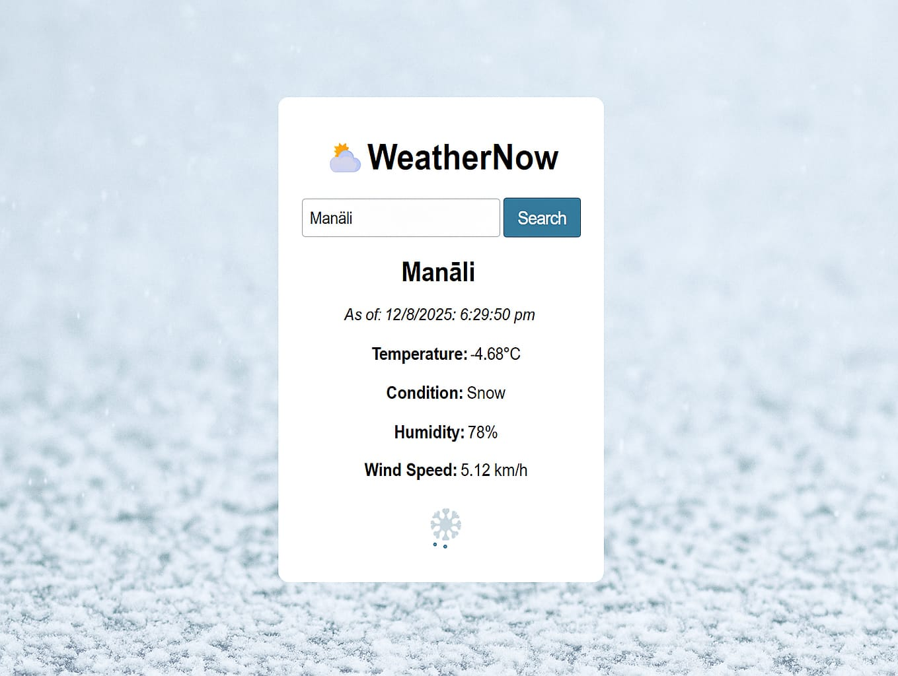

# 🌦 WeatherNow – Simple Weather App

WeatherNow is a simple weather application built using HTML, CSS, and JavaScript. It fetches real-time weather data using the OpenWeatherMap API and dynamically updates background images based on weather conditions like clear, clouds, rain, and snow.

---

## 🔍 Features

- Get real-time weather data by city name
- Displays temperature, humidity, wind speed, and condition
- Background image changes as per weather condition
- Loader animation during fetch
- Responsive and user-friendly UI

---

## 🛠 Technologies Used

- HTML5
- CSS3
- JavaScript (Fetch API)
- OpenWeatherMap API

---

## 🖼 Output Previews

#### ☀ Clear Weather


#### ☁ Cloudy Weather


#### 🌧 Rainy Weather


#### ❄ Snowy Weather


---

## 🚀 How to Use

1. Clone the repository:
   ```bash
   git clone https://github.com/SakshiParalekar/WeatherNow-app

--

## ❤ Thank You
Thank you for checking out this project! Feel free to star the repo if you found it helpful.
